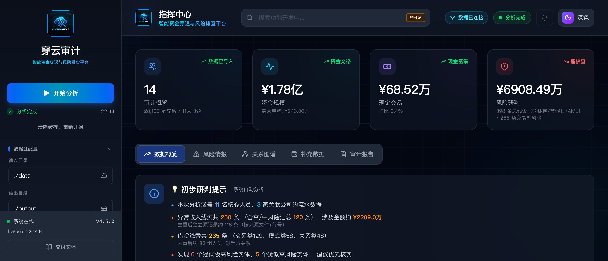

# 穿云审计 (F.P.A.S)

> 当前版本：`v4.6.0`
>
> 当前交付形态：`Windows 单机离线 one-folder 包`
>
> 启动方式：Windows 交付环境双击 `fpas.exe`；源码环境运行 `python api_server.py`
>
> 原始数据准备：把所有轮次的协查原始文件按查询原样放在同一个根目录，不必改名、不必重组；银行、微信、支付宝、财付通及其他协查数据都放进去，然后在前端把该目录选为“输入目录”
>
> 应用内文档入口：启动后访问 `/docs/readme`，或在左下角点击“交付文档”

穿云审计是一套面向审计核查、资金穿透和关联排查的离线系统。它不是通用 BI 工具，也不是“导入 Excel 看图表”的轻报表工具。它的核心目标只有一个：

**把原始数据、清洗结果、分析缓存、正式报告和前端展示统一到一条可复核的主链上，尽量减少口径漂移和报告打脸。**



---

## 首次使用帮助

### 适合谁看

本 README 主要面向：

- 首次接触系统的使用者
- 负责运行分析、查看报告、导出结果的业务人员
- 需要确认“哪个文件是最终结果、哪个文件只是内部检查产物”的交付接收人员

如果你主要关心研发和二次开发，文末保留了最少量的开发入口，其余技术细节请看 `docs/` 下专题文档。

### 第一次使用前先确认

- 如果你使用交付包，直接双击 `fpas.exe` 即可，不需要额外安装 Python
- 如果你使用源码运行，才需要本机具备 `Python 3.9+`
- 原始协查数据可以放在任意目录，`data/` 只是默认示例目录，不是强制要求
- 正式访问入口固定为 `http://127.0.0.1:8000/dashboard/`
- 如需重跑全量分析，应接受当前选中输出目录下的分析产物会被刷新

### 最短上手路径

第一次使用时，按这条最短路径就够了：

`按原样放好协查数据 -> 启动 fpas.exe / api_server.py -> 打开 dashboard -> 选输入/输出目录 -> 开始分析 -> 看 HTML 报告 -> 必要时回看 cleaned_data`

### 第一次启动怎么做

#### 1. 准备数据

- 把所有轮次的协查原始文件放在同一个根目录下
- 保持查询导出时的原始目录结构和文件名，不需要手工改名、合并或拆散
- 这个根目录里可以同时包含银行流水、账户信息、房产、车辆、证券、理财、微信、支付宝、财付通等各类协查数据
- `data/` 只是默认示例目录；如果你的数据在别的盘符或别的文件夹，也可以直接在前端选择那个目录

示例：

```text
某次案件原始数据/
├── 第一轮/
│   ├── 银行业金融机构交易流水（定向查询）/
│   ├── 银行业金融机构账户信息（定向查询）/
│   ├── 支付机构交易明细（支付宝）/
│   └── 微信支付相关数据/
├── 第二轮/
│   ├── 银行业金融机构交易流水（定向查询）/
│   ├── 财付通交易明细/
│   └── 其他协查材料/
└── 第三轮/
    └── ...
```

原则只有一条：

- 所有轮次原始文件按查询原样放在一个总目录里，然后在前端把这个总目录指定为“输入目录”

#### 2. 启动系统

交付使用优先按下面方式启动：

```text
双击 fpas.exe
```

如果你在源码环境下运行，才使用：

```bash
python api_server.py
```

启动后访问：

```text
http://127.0.0.1:8000/dashboard/
```

说明：

- 这是正式访问入口
- 交付环境下也应以这个地址为准
- Windows one-folder 交付包双击 `fpas.exe` 后，会默认自动打开系统默认浏览器并进入这个地址
- 如果需要关闭自动打开浏览器，可在启动前设置环境变量 `FPAS_AUTO_OPEN_BROWSER=0`
- 前端开发服务器 `5173` 只用于调试，不是正式交付入口

#### 3. 选择目录并开始分析

进入前端后，先确认左侧“数据源配置”：

- 输入目录：选择你刚才存放原始协查数据的总目录
- 输出目录：选择本轮分析结果要写入的位置

确认无误后，再完成对象归集/范围确认，并点击“开始分析”。

系统会依次生成三层结果：

1. `output/cleaned_data/`
2. `output/analysis_cache/`
3. `output/analysis_results/`

### 输入目录 / 输出目录可以自己选吗

可以，当前程序已真实支持手动切换输入目录和输出目录。

使用方式：

- 在左侧“数据源配置”里直接填写，或点击文件夹按钮选择目录
- 输入目录决定本轮扫描的原始数据根目录
- 输出目录决定 `cleaned_data`、`analysis_cache`、`analysis_results` 的实际生成位置

生效方式：

- 前端修改后会同步到后端当前活动路径
- 点击“开始分析”时，分析任务会直接使用当前选中的输入目录和输出目录
- 如果只是切换输出目录，前端还会尝试恢复该目录下已有的缓存和报告结果

保留方式：

- 你在前端选过的路径会保存在本机浏览器 `localStorage`
- 下次重新打开前端时，系统会优先恢复这些路径，再同步到后端

需要注意：

- 分析运行中不允许切换输入/输出目录
- 如果改了输出目录，本轮之后的报告、缓存和导出结果都会写到新目录

### 第一次跑完后怎么判断是否成功

至少检查这 4 件事：

1. 能正常打开 `http://127.0.0.1:8000/dashboard/`
2. 当前输出目录下的 `analysis_results/` 已经生成 `初查报告.html`
3. 当前输出目录下的 `analysis_results/` 已经生成 `核查结果分析报告.txt` 和 `资金核查底稿.xlsx`
4. 前端“审计报告”页能看到正式报告，而不是只剩空白卡片或报错提示

#### 4. 查看结果

建议按下面顺序看：

1. `/dashboard/` 中的“审计报告”页
2. 当前输出目录下的 `analysis_results/初查报告.html`
3. 当前输出目录下的 `analysis_results/核查结果分析报告.txt`
4. 当前输出目录下的 `analysis_results/资金核查底稿.xlsx`
5. 如需追溯原始明细，再看当前输出目录下的 `cleaned_data/`

如果导入了微信 / 支付宝 / 财付通样本，也可以在 `/dashboard/` 的“电子钱包”页查看电子钱包摘要、预警和未归并微信账号。

#### 5. 哪些文件是正式交付结果

优先认这几类：

- `output/analysis_results/初查报告.html`
- `output/analysis_results/核查结果分析报告.txt`
- `output/analysis_results/资金核查底稿.xlsx`
- `output/analysis_results/专项报告/` 下的正式附录

不要把下面这些当成业务终稿：

- `output/analysis_results/qa/`
- `output/analysis_cache/*.json`
- 各类中间语义包、检查包、调试文件

---

## 程序结构

下面展示的是交付视角下最值得认识的主结构。它不是完整源码清单，但足够帮助你判断“入口在哪、结果在哪、追溯去哪看”。

```text
cj-project/
├── api_server.py                      # 后端唯一入口 /dashboard/ 也由它承载
├── data_cleaner.py                    # 银行流水清洗、标准化、去重
├── financial_profiler.py              # 人员/家庭/公司画像与收支口径汇总
├── suspicion_engine.py                # 疑点识别与问题卡来源之一
├── investigation_report_builder.py    # 正式报告、report_package、检查产物构建
├── report_quality_guard.py            # 正式报告质量门控
├── html_report_consistency_audit.py   # HTML 最终展示数字反查
├── build_windows_package.py           # Windows 离线打包
├── dashboard/
│   ├── src/
│   │   ├── components/                # 页面与核心卡片
│   │   ├── services/                  # 前端 API 调用
│   │   ├── contexts/                  # 全局状态
│   │   └── types/                     # 前端类型定义
│   └── dist/                          # 前端生产构建，交付时由后端直接提供
├── classifiers/                       # 交易分类引擎
├── detectors/                         # 疑点检测器
├── schemas/                           # 数据模型
├── output/
│   ├── cleaned_data/                  # 清洗成品层
│   ├── analysis_cache/                # 分析缓存层
│   └── analysis_results/              # 正式结果层
├── docs/
│   ├── assets/                        # README 和交付截图等静态资源
│   └── change_logs/                   # 按日期记录的重要修改
├── data/                              # 默认原始协查数据入口（也可在前端指定任意目录）
└── tests/                             # 回归测试
```

输出目录也可以这样理解：

```text
output/
├── cleaned_data/
│   ├── 个人/
│   └── 公司/
├── analysis_cache/
│   ├── profiles.json
│   ├── derived_data.json
│   ├── suspicions.json
│   ├── graph_data.json
│   └── ...
└── analysis_results/
    ├── 初查报告.html
    ├── 核查结果分析报告.txt
    ├── 资金核查底稿.xlsx
    ├── 专项报告/
    └── qa/
```

---

## 系统主线怎么理解

### 一句话主链

`原始数据 -> 清洗成品 -> 分析缓存 -> 正式报告 -> 前端展示`

### 首次使用时要抓住的 3 个位置

- `当前输入目录`：原始数据入口，默认是 `data/`，也可以在前端改成任意目录
- `output/analysis_results/`：正式交付结果集中区
- `output/cleaned_data/`：发生争议时最先回看的事实层

### 三层输出各自负责什么

#### `output/cleaned_data/`

这是事实层。

如果你在核对：

- 某个人到底有多少笔银行流水
- 某家公司流入流出到底是多少
- 某一笔钱能不能回到具体来源文件和来源行号

优先看这里。

#### `output/analysis_cache/`

这是统一语义层。

这里保存的是系统汇总后的画像与分析结果，例如：

- `profiles.json`
- `derived_data.json`
- `suspicions.json`
- `graph_data.json`

正式报告构建器和前端都优先使用这里的结果，不应该各自再回原始 `data/` 重新拼口径。

#### `output/analysis_results/`

这是交付层。

这里保存的是最终给人看的结果：

- HTML 报告
- TXT 报告
- Excel 底稿
- 专项报告
- 报告目录清单

---

## 真实收入 / 真实支出是什么意思

系统不会把银行原始总流入直接当成“可支配收入”。

当前口径是：

- 先统计原始总流入、原始总流出
- 再识别并剔除不应算作真实收入/支出的内部循环项

常见剔除项包括：

- 本人账户互转
- 理财 / 定存本金循环
- 银行产品回摆、分期冲销
- 家庭成员互转
- 报销、退款、冲正类回流

所以：

- `总流入 / 总流出` 是原始盘子
- `真实收入 / 真实支出` 是剔除内部循环后的口径

这也是为什么系统会同时保留原始流量和真实流量两组数。

---

## 报告中心现在展示什么

前端“审计报告”页面现在面向业务使用者，只展示正式可读产物。

会展示的内容：

- 主报告摘要
- 优先对象
- 问题卡
- 卷宗覆盖
- 正式报告预览与下载入口

不会直接展示的内容：

- `qa/` 目录检查产物
- `.json` 结构化缓存
- 内部语义包
- 研发排障文件

如需追溯，使用者可以直接打开：

- `cleaned_data/个人`
- `cleaned_data/公司`
- `analysis_results`

但业务视图层不会主动把内部 QA 物料暴露出来。

---

## 电子钱包页面展示什么

前端“电子钱包”页对应的是微信、支付宝、财付通这类电子钱包数据。

这个页面主要展示：

- 电子钱包主体摘要
- 高风险电子钱包预警
- 未归并微信账号
- 主体映射线索和主要对手方

需要注意：

- 电子钱包数据属于补充层，不覆盖银行主清洗链
- 它会进入 `analysis_cache/walletData.json`，供前端页面和部分风险视图复用

---

## 归集配置怎么生效

前端“审计报告”中的“归集配置”不是只影响页面展示，它会影响报告组织方式，并会在保存后参与后续分析复用。

真实机制如下：

1. 当当前输入目录下还没有 `primary_targets.json` 时，系统会先根据当前输出目录中的 `analysis_cache` 自动生成一份默认归集配置供界面使用。
2. 如果存在官方同户人 / 户籍数据，默认主归集人优先取户主。
3. 如果没有足够的官方户籍数据，系统会回退到自动识别的家庭单元或独立单元，此时默认锚点不一定等于“本人”。
4. 在你手动调整“主归集人”并点击“保存配置”后，系统会把正式配置写入当前输入目录下的 `primary_targets.json`。
5. 后续重新分析、生成 TXT 报告、生成 HTML 报告时，系统都会优先读取这个 `primary_targets.json`，而不是继续只用自动推断结果。

需要特别区分两类文件：

- `data/` 或当前输入目录下的 `primary_targets.json`
  这是正式归集配置，只有手动保存后才会生成，并会被后续分析复用。
- 当前输出目录 `analysis_cache/primary_targets.auto.json`
  这是系统在未发现正式配置时自动生成的临时快照，用于复核和复现，不作为正式用户配置优先加载。

这意味着：

- 第一次运行后，系统可以先给出默认归集方案
- 但只有你手动确认并保存后，这份归集方案才会成为后续分析默认使用的正式配置

---

## 检查函数怎么工作

这里的“检查函数”不是做业务分析，而是做**质量门控和一致性检查**。它们的目的，是防止正式报告、前端展示和底层缓存再次各说各话。

可以把这套逻辑理解成 4 道闸门：

`先整理统一语义包 -> 再检查正式报告 -> 再反查 HTML 展示 -> 最后判断旧检查包是否过期`

### 1. `report_package.json` 是怎么来的

实现位置：

- `investigation_report_builder.py`
- 关键函数：`save_report_package_artifacts()`

它会把正式报告里真正需要被前端和检查器复用的内容，整理成统一语义包，包括：

- 主报告摘要
- 附录摘要
- 个人 / 家庭 / 公司报告条目
- 问题卡
- 证据索引
- QA 检查结果

你可以把它理解成“正式报告的结构化镜像”。

前端报告中心优先读它，而不是再自己拼一套摘要。这样做的目的，是让前端展示、正式报告摘要和内部检查尽量共用同一份语义来源。

### 2. `run_report_quality_checks()` 主要检查什么

实现位置：

- `report_quality_guard.py`

它不是简单看文件存不存在，而是检查几类关键一致性问题，例如：

- 是否生成了正式 HTML；如果没有，报告目录清单是否正确回退到 TXT
- 个人财务缺口解释，是否真的出现在正式 TXT / HTML 中
- 报告里如果写了“闭环”“团伙”等强结论，语义事实层是否真有对应证据
- 正式报告是否泄露了 `analysis_cache` 之类的内部路径
- 高风险问题卡是否带有最基本的 `evidence_refs` 和原因说明

它的输出会写到：

- `output/analysis_results/qa/report_consistency_check.json`
- `output/analysis_results/qa/report_consistency_check.txt`

这些文件是系统内部质量门控依据，不是业务终稿。

如果这里失败，通常意味着“正式报告里缺了该写明的解释”或者“结论强度高于证据支撑”。

### 3. `audit_html_report()` 主要检查什么

实现位置：

- `html_report_consistency_audit.py`

这个脚本会直接解析最终 HTML，再反向核对：

- 人员概览卡片里的总流入、总流出、工资收入、真实收入
- 工资章节里的年度工资表和总额
- 家庭章节、公司章节中的关键摘要

它比“看脚本有没有跑完”更严格，因为它直接对最终展示结果下手。

换句话说，前面几层都对，不代表最后渲染出来就一定对；这个审计就是专门防这种“底层对了、展示错了”的情况。

输出位置：

- `output/analysis_results/qa/html_report_consistency_audit.json`
- `output/analysis_results/qa/html_report_consistency_audit.txt`

### 4. 系统什么时候会自动刷新这些检查产物

实现位置：

- `api_server.py`
- 关键逻辑：`_report_package_requires_refresh()`

只要出现下面任一情况，系统就会认定旧检查包过期并尝试刷新：

- QA 规则版本变了
- 报告语义逻辑文件更新了
- 正式报告文件比旧语义包更新
- 人员 / 家庭 / 公司条目中缺少必要解释字段
- `qa/` 下关键检查文件缺失

这套逻辑的作用，是防止：

**源码改了、报告改了，但前端还在读旧语义包。**

### 5. 检查失败后应该先看哪里

建议按这个顺序排：

1. `output/cleaned_data/` 是否已经包含正确事实
2. `output/analysis_cache/` 中的画像和汇总是否已同步更新
3. `output/analysis_results/qa/report_package.json` 是否还是旧包
4. `output/analysis_results/qa/report_consistency_check.txt` 和 `html_report_consistency_audit.txt` 报的是什么

如果前两层是对的，而后两层报错，通常问题已经不在原始数据，而在报告构建或展示层。

---

## 哪些结果最值得优先看

如果你是第一次接手一轮分析，建议按这个顺序：

1. `output/analysis_results/初查报告.html`
   - 最适合快速浏览
2. `output/analysis_results/核查结果分析报告.txt`
   - 适合正式存档和文本检索
3. `output/analysis_results/资金核查底稿.xlsx`
   - 适合人工追溯和对账
4. `output/cleaned_data/`
   - 适合逐笔核对

如果你看到前端和报告数字不一致，不要先猜 UI 出错，先看：

1. `output/cleaned_data/`
2. `output/analysis_cache/profiles.json`
3. `output/analysis_results/qa/report_package.json`

---

## 常见问题

### 1. 我到底应该以哪里为准？

- 核对交易事实：以 `output/cleaned_data/` 为准
- 核对正式汇总口径：以 `output/analysis_cache/` 为准
- 核对交付成稿：以 `output/analysis_results/` 为准

### 2. 为什么前端页面不展示 QA 和 JSON 文件？

因为这些文件是内部检查和结构化语义产物，普通业务人员看不懂，也容易造成误解。前端业务视图只应展示最终可阅读的正式结论。

### 3. 为什么“真实收入”比“总流入”小很多？

因为系统会剔除本人互转、理财本金循环、家庭互转、退款冲正等内部循环项。总流入是原始盘子，真实收入是剔除后的口径。

### 4. 现在还需要单独启动前端开发服务器吗？

普通使用不需要。正式访问只看：

```text
http://127.0.0.1:8000/dashboard/
```

---

## 版权与免责

- 当前交付版本及界面中的版权标识为 `© 811所纪委`，用于标识本次交付归属。
- 本仓库代码和文档可以按需要开放查看、审计和二次开发。
- 但项目按当前状态提供，不默认承诺后续持续升级、专项适配、兼容性修复、环境部署支持或结果解释支持。
- 在正式生产、审计办案或对外引用前，使用方仍应结合本单位数据、流程和运行环境自行复核。

---

## 附：最少量调试入口

普通使用可以跳过本节。只有在需要本地调试时才看这里。

如果你确实需要调试前端，可以使用：

```bash
python api_server.py
cd dashboard
npm run dev
```

如果你需要生成前端生产构建：

```bash
cd dashboard
npm run build
```

如果你需要 Windows 离线打包：

```bash
python build_windows_package.py --preflight
```

说明：

- 在 macOS 上，当前只能执行 `--preflight` 预检和 `npm run build` 这类交付前准备，不能产出最终 Windows one-folder 包
- 目标是 `Windows7+` 时，最终打包机应为 `Windows + Python 3.8.x`
- 真正产出离线交付包时，再在 Windows 机器上执行：

```bash
python build_windows_package.py
```

更深入的研发说明请看：

- [CHANGELOG.md](/Users/chenjian/Desktop/Code/cj-project/CHANGELOG.md)
- [WINDOWS_OFFLINE_DELIVERY.md](/Users/chenjian/Desktop/Code/cj-project/WINDOWS_OFFLINE_DELIVERY.md)
- [docs](/Users/chenjian/Desktop/Code/cj-project/docs)
