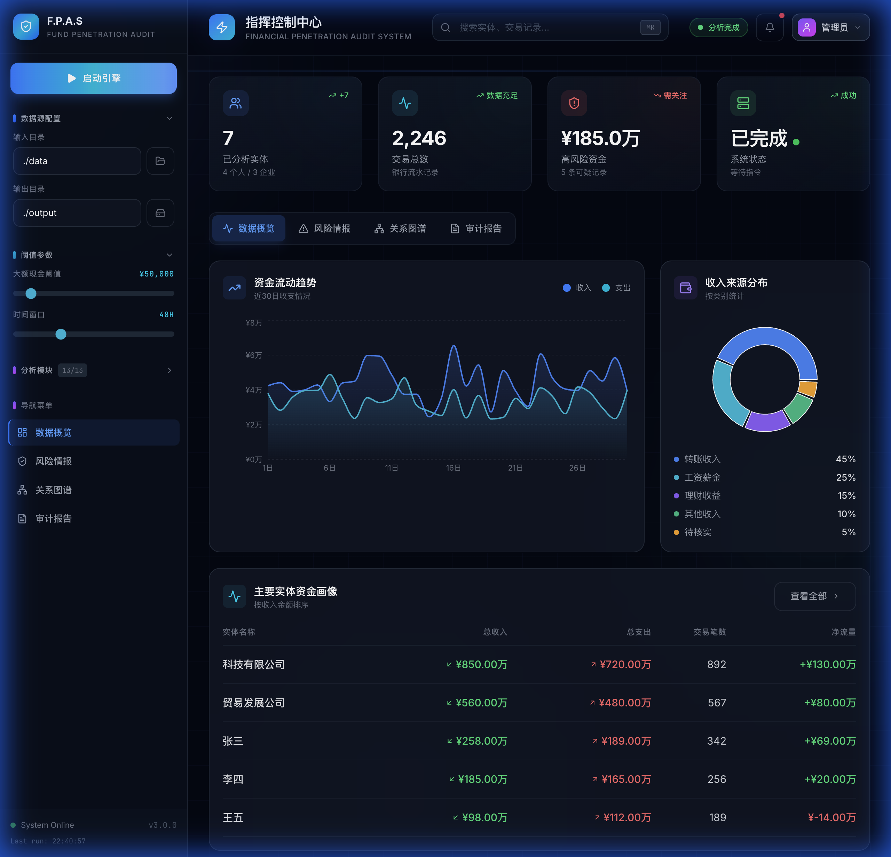
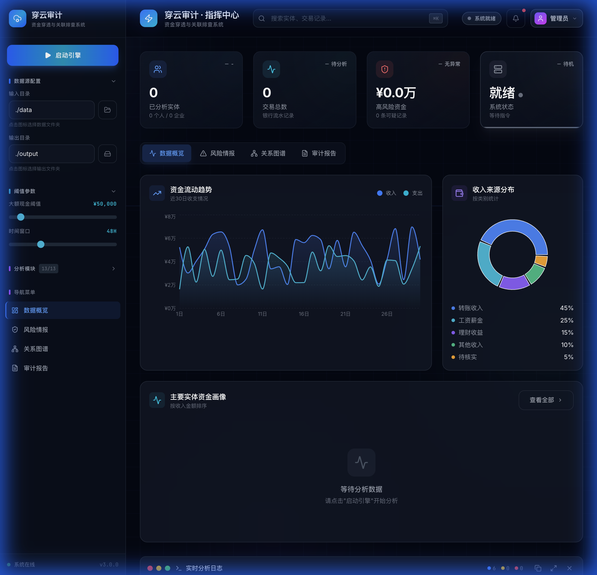
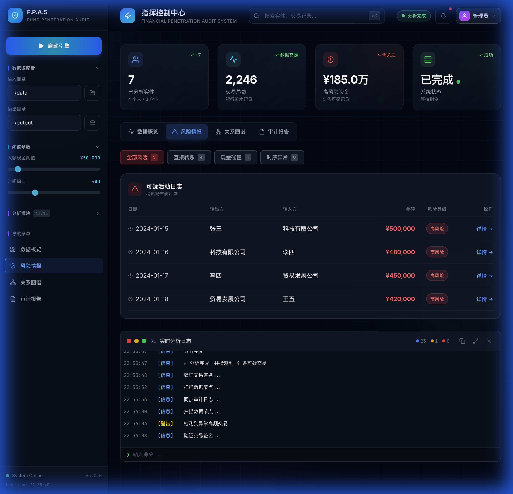

# 穿云审计

<div align="center">
  
  
  <h3>资金穿透与关联排查系统</h3>
  <p>专业的金融审计分析平台，帮助审计人员高效完成资金流向分析、可疑交易检测、关联关系排查</p>

  <p>
    
    
    
    
    
  </p>
</div>

---

## ✨ 功能特性

### 🔍 核心分析能力
- **资金画像分析** - 自动生成实体的资金收支画像
- **疑点碰撞检测** - 识别个人与企业间的异常直接转账
- **现金碰撞分析** - 检测同一时段的大额现金存取巧合
- **资金穿透追踪** - 多层次资金流向追踪与可视化
- **关联方分析** - 发现隐藏的关联交易关系
- **借贷行为识别** - 识别民间借贷和网贷平台交易
- **异常收入检测** - 发现来源不明的大额收入
- **ML 风险预测** - 基于机器学习的异常交易预警

### 📊 专业可视化 Dashboard

<table>
  <tr>
    <td width="50%">
      
      <p align="center"><em>侧边栏配置面板</em></p>
    </td>
    <td width="50%">
      
      <p align="center"><em>风险情报监控</em></p>
    </td>
  </tr>
</table>

- **现代化深色主题** - 玻璃态效果、流畅动画
- **实时数据可视化** - Recharts 图表展示资金趋势
- **可疑交易高亮** - 风险等级标注与详情查看
- **实时日志推送** - WebSocket 实时显示分析进度
- **响应式设计** - 适配桌面和平板设备

### 📝 审计报告输出
- **Excel 核查底稿** - 完整的分析结果工作表
- **HTML 综合报告** - 详细的文字分析报告
- **资金流向图** - 交互式资金关系可视化

---

## 🚀 快速开始

### 环境要求

- Python 3.9+
- Node.js 18+
- npm 或 pnpm

### 安装步骤

```bash
# 克隆项目
git clone https://github.com/your-repo/cj-project.git
cd cj-project

# 安装 Python 依赖
pip install -r requirements.txt

# 安装前端依赖
cd dashboard
npm install
```

### 启动系统

**方式一：使用 Dashboard（推荐）**

```bash
# 终端 1：启动前端
cd dashboard
npm run dev

# 终端 2：启动后端 API（可选，用于真实数据分析）
pip install fastapi uvicorn
python api_server.py
```

访问 http://localhost:5173 打开 Dashboard。

**方式二：命令行执行**

```bash
python main.py --input ./data --output ./output
```

---

## 📁 项目结构

```
cj-project/
├── dashboard/              # React 前端 Dashboard
│   ├── src/
│   │   ├── components/    # UI 组件
│   │   ├── contexts/      # 状态管理
│   │   ├── services/      # API 服务
│   │   └── types/         # TypeScript 类型
│   └── package.json
├── docs/                   # 文档和截图
│   └── screenshots/
├── api_server.py           # FastAPI 后端服务
├── main.py                 # 命令行入口
├── config.py               # 配置参数
├── file_categorizer.py     # 文件分类器
├── data_cleaner.py         # 数据清洗
├── data_extractor.py       # 线索提取
├── financial_profiler.py   # 资金画像
├── suspicion_detector.py   # 疑点检测
├── fund_penetration.py     # 资金穿透
├── related_party_analyzer.py   # 关联方分析
├── loan_analyzer.py        # 借贷分析
├── income_analyzer.py      # 收入分析
├── ml_analyzer.py          # 机器学习分析
├── time_series_analyzer.py # 时间序列分析
├── clue_aggregator.py      # 线索聚合
├── report_generator.py     # 报告生成
└── requirements.txt        # Python 依赖
```

---

## ⚙️ 配置说明

### 阈值参数 (`config.py`)

| 参数 | 默认值 | 说明 |
|------|--------|------|
| `LARGE_CASH_THRESHOLD` | 50,000 | 大额现金交易阈值 (元) |
| `SUSPICION_TIME_WINDOW` | 48 | 现金碰撞时间窗口 (小时) |
| `LARGE_TRANSFER_THRESHOLD` | 100,000 | 大额转账阈值 (元) |
| `HIGH_FREQUENCY_THRESHOLD` | 10 | 高频交易次数阈值 |

### 环境变量

```env
# .env.development
VITE_API_URL=http://localhost:8000
VITE_WS_URL=ws://localhost:8000/ws
```

---

## 🔧 技术栈

### 后端
- **Python 3.9+** - 核心分析引擎
- **Pandas** - 数据处理
- **FastAPI** - API 服务
- **WebSocket** - 实时通信

### 前端
- **React 19** - UI 框架
- **TypeScript** - 类型安全
- **Vite** - 构建工具
- **TailwindCSS** - 样式框架
- **Recharts** - 数据可视化
- **Lucide React** - 图标库

---

## 📄 开源协议

本项目采用 [MIT License](LICENSE) 开源协议。

---

## 🤝 贡献

欢迎提交 Issue 和 Pull Request！

---

<div align="center">
  <p>
    <strong>穿云审计</strong> - 穿透资金迷雾，洞察财务真相
  </p>
  <p>
    <sub>Built with ❤️ for auditors</sub>
  </p>
</div>
