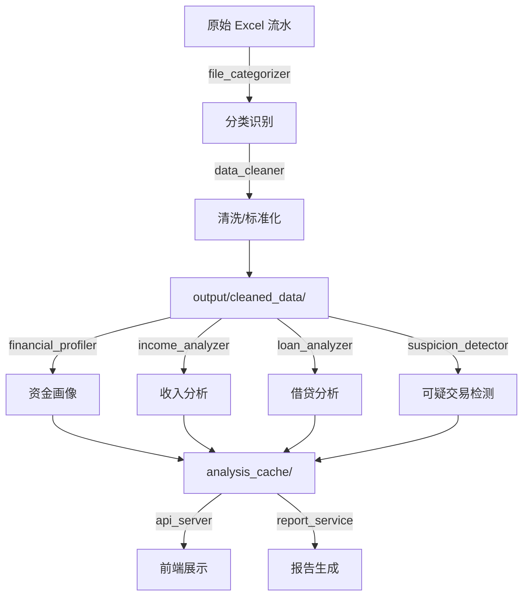

# 穿云审计 - 系统架构概览

## 一、整体数据流



---

## 二、核心模块职责

| 模块 | 职责 | 输入 | 输出 |
|------|------|------|------|
| `data_cleaner.py` | 数据清洗/去重/标准化 | 原始 Excel | `cleaned_data/*.xlsx` |
| `financial_profiler.py` | 资金画像生成 | cleaned_data | profiles.json |
| `income_analyzer.py` | 异常收入检测 | cleaned_data | income 分析结果 |
| `loan_analyzer.py` | 借贷行为分析 | cleaned_data | loan 分析结果 |
| `suspicion_detector.py` | 可疑交易检测 | cleaned_data | suspicions.json |
| `api_server.py` | REST API + WebSocket | 缓存数据 | JSON 响应 |
| `report_service.py` | 公文格式报告生成 | 缓存数据 | HTML 报告 |

---

## 三、数据清洗逻辑 (`data_cleaner.py`)

### 3.1 智能字段标准化
```python
standardize_bank_fields(df, bank_name)
```
- **统一列名映射**: 交易日期 → `日期`, 交易金额 → `金额(元)`, 交易对手 → `对手方`
- **现金识别**: 
  - 遍历摘要中的"ATM取款"、"现金存入"、"柜台取现"等关键词
  - 写入 `is_cash = True/False` 和 `现金` 列
- **收支分离**: 根据金额正负或借贷标志拆分收入/支出

### 3.2 数据去重
```python
deduplicate_transactions(df)
```
- 基于 `(日期, 金额, 对手方, 摘要)` 组合判重
- 保留第一条，记录被去除的重复项数量

### 3.3 数据质量验证
```python
validate_data_quality(df)
```
- 必填字段检查: 日期/金额/摘要
- 金额范围校验: 排除异常值 (如负金额或超大金额)
- 日期格式统一

### 3.4 输出格式
- Excel (`.xlsx`) - 人工审阅
- Parquet (`.parquet`) - 高性能读取

---

## 四、后端计算模块

### 4.1 资金画像 (`financial_profiler.py`)

| 计算项 | 方法 | 说明 |
|--------|------|------|
| **工资识别** | `calculate_income_structure()` | 4轮识别: 白名单单位 → 关键词 → 人力公司 → 高频稳定 |
| **工资占比** | `salary_ratio = salaryTotal / totalIncome` | 低于50%标红 |
| **第三方支付** | `analyze_fund_flow()` | 微信/支付宝/财付通等识别 |
| **现金交易** | `analyze_fund_flow()` | ATM取现/存现汇总 |
| **理财持仓** | `analyze_wealth_holdings()` | 购买-赎回=持仓估算 |

### 4.2 异常收入检测 (`income_analyzer.py`)

| 检测类型 | 函数 | 判断逻辑 |
|----------|------|----------|
| **规律性非工资收入** | `_detect_regular_non_salary()` | 同一来源 ≥3次, 金额规律, 非工资 |
| **大额个人转入** | `_detect_individual_income()` | 个人→个人, 金额 ≥5万 |
| **来源不明收入** | `_detect_unknown_income()` | 对手方为空/模糊, 金额 ≥10万 |
| **大额单笔收入** | `_detect_large_single_income()` | 单笔 ≥10万, 非理财赎回 |
| **同源多次收入** | `_detect_same_source_multi()` | 同一对手 ≥5次, 累计 ≥10万 |

### 4.3 借贷行为分析 (`loan_analyzer.py`)

| 检测类型 | 函数 | 判断逻辑 |
|----------|------|----------|
| **双向资金往来** | `_detect_bidirectional_flows()` | 与某对手既收又支, 金额 ≥1万 |
| **网贷平台往来** | `_detect_online_loans()` | 识别"拍拍贷/借呗/微粒贷"等 |
| **规律性还款** | `_detect_regular_repayments()` | 固定日期向同一对手支出 ≥3次 |
| **借贷配对** | `_detect_loan_pairs()` | 时间窗口内的借入-还款匹配 |
| **无还款借贷** | `_detect_no_repayment_loans()` | 大额收入180天内无对应还款 |

### 4.4 可疑交易检测 (`suspicion_detector.py`)

| 检测类型 | 函数 | 判断逻辑 |
|----------|------|----------|
| **现金时空伴随** | `detect_cash_time_collision()` | A取现 → B存现, 时间差 ≤48h, 金额接近 |
| **跨实体现金碰撞** | `detect_cross_entity_cash_collision()` | 跨人员的取存配对 |
| **直接转账** | 从 profiles 提取 | 核心人员 ↔ 涉案公司 直接交易 |

---

## 五、缓存文件结构

```
output/
├── cleaned_data/
│   ├── 个人/
│   │   ├── 施灵.xlsx
│   │   └── 施灵.parquet
│   └── 公司/
│       └── 上海派尼斯.xlsx
└── analysis_cache/
    ├── metadata.json      # 人员/公司列表, 生成时间
    ├── profiles.json      # 所有画像数据 (扁平结构)
    ├── suspicions.json    # 可疑交易检测结果
    ├── derived_data.json  # income/loan 分析结果
    └── graph_data.json    # 图谱节点/边数据
```

---

## 六、数据复用铁律

> **核心原则**: 下游模块严禁重新读取原始 Excel，必须复用上游已清洗/已计算的结果。

| ❌ 禁止 | ✅ 正确做法 |
|---------|-------------|
| 在 `api_server.py` 中重新读 `data/*.xlsx` | 从 `cleaned_data/` 读取 |
| 在报告生成时重新计算工资占比 | 从 `profiles.json` 读取 `salaryRatio` |
| 用关键词判断是否为现金交易 | 读取 `is_cash` 或 `现金` 列 |
